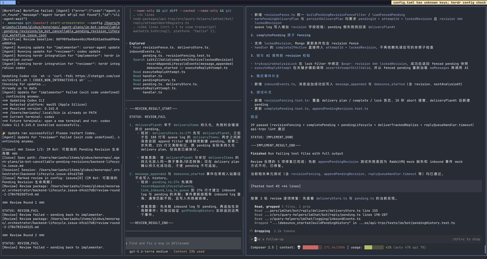
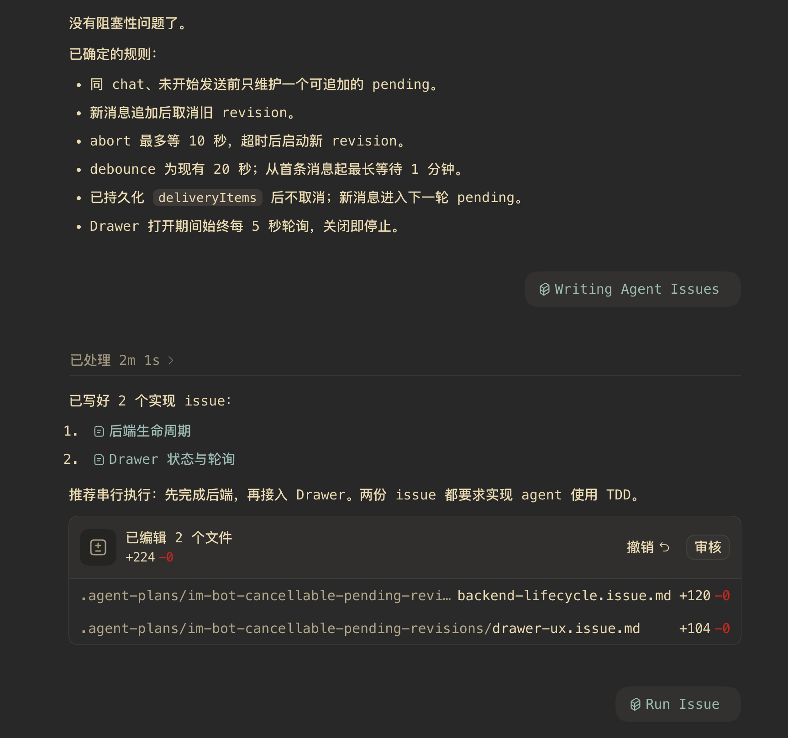

# mini-orch

`mini-orch` 是一个自动编排开发与代码审查的 CLI 工具。

它会依次完成：

1. 让 implementer agent 根据需求实现代码
2. 让 reviewer agent 审查改动
3. 如果审查失败，自动让 implementer 修复
4. 重复上述流程，直到通过或达到最大审查轮数

## 使用前准备

请先安装并准备好：

- Node.js 20 或更高版本
- Herdr
- 至少一个 agent CLI：Codex、Claude 或 Cursor
- 对应 agent 的登录和使用权限

`mini-orch` 需要在 Herdr pane 内运行。

## 安装

```bash
npm install -g mini-orch
```

确认安装成功：

```bash
mini-orch --help
```

## 安装 Skill

查看可用 skill：

```bash
mini-orch skill list
```

交互式安装，或指定 skill 安装：

```bash
mini-orch skill install
mini-orch skill install --skill run-issue
```

卸载指定 skill：

```bash
mini-orch skill uninstall --skill run-issue
```

各个 skill 的作用、依赖关系和安装方式见 [Skill 说明](skills/README.md)。

## 我的工作流

我通常按照下面的流程推进开发任务：

1. 和 agent 交流，先对齐想法和目标
2. 使用 `writing-agent-issues` 产出可执行的 spec / issue 文档
3. 使用 `run-issue` 生成编排器配置
4. 在 LLM / terminal 环境中执行 `mini-orch`



## 快速开始

### 1. 准备需求文件

先写一个需求文件，例如 `spec.md`：

```md
# 添加用户登录功能

## 要求

- 支持邮箱和密码登录
- 登录失败时返回明确错误
- 添加必要的测试
```

### 2. 创建工作流配置

创建 `workflow.json`：

```json
{
  "projectDir": "/absolute/path/to/your/project",
  "issues": [
    {
      "title": "实现用户登录功能",
      "specPath": "/absolute/path/to/spec.md"
    }
  ],
  "maxReviewRounds": 4,
  "implementer": {
    "name": "implementer",
    "agent": "codex",
    "model": "gpt-5.5"
  },
  "reviewer": {
    "name": "reviewer",
    "agent": "codex",
    "model": "gpt-5.5"
  }
}
```

需要替换：

- `projectDir`：要修改的项目目录
- `specPath`：需求文件路径
- `agent` 和 `model`：你实际使用的 agent 和模型

路径建议使用绝对路径。

默认提示词已经随 npm 包提供，不需要复制 `prompts/` 目录。只有需要自定义提示词时，才在配置中添加 `prompts` 字段。

### 3. 启动工作流

在 Herdr pane 内运行：

```bash
mini-orch --config ./workflow.json
```

## 多个任务

可以在 `issues` 中按顺序添加多个任务：

```json
{
  "issues": [
    {
      "title": "第一步：设计数据库",
      "specPath": "/absolute/path/to/database.md"
    },
    {
      "title": "第二步：实现 API",
      "specPath": "/absolute/path/to/api.md"
    }
  ]
}
```

任务会按照数组顺序执行。已完成的任务可以设置 `"state": "finish"`，运行时会自动跳过。

## 最终审查（finalGate）

可选地为整个 workflow 增加一个独立的全局审查环节：所有 issue 完成后，Final Reviewer 对合并结果做最终审查；发现问题时由 Final Fixer 修复并重新审查，直到通过或达到轮次上限。只有最终审查通过，workflow 才会成功完成并发布 `complete`。

```json
{
  "finalGate": {
    "maxRounds": 3,
    "reviewer": {
      "name": "final-reviewer",
      "agent": "codex",
      "model": "gpt-5.5"
    },
    "fixer": {
      "name": "final-fixer",
      "agent": "codex",
      "model": "gpt-5.5"
    }
  }
}
```

规则：

- 不配置 `finalGate`，或配置 `"enabled": false`，则完全保持旧行为，不会启用最终审查。
- 启用时 `reviewer` 与 `fixer` 都是必填的完整 agent 配置，缺少任一字段会在启动阶段报错。
- `maxRounds` 是 final gate 独立的轮次上限，缺省为 3；它不受 `--maxReviewRounds` 影响（后者只作用于单个 issue 的局部 review）。
- 内置的 final review / final fix 提示词已随包提供；如需覆盖，在 `finalGate.prompts` 中指定 `review` / `fix` 的路径（路径相对于配置文件目录），自定义 output partial 同样对它们生效。
- 达到轮次上限仍未通过时，workflow 发布失败并以非零码退出，由 workflow 启动的 final pane 会被关闭，不会发布 `complete` 或成功通知。
- Final Reviewer / Final Fixer 复用现有的 `REVIEW_*` / `IMPLEMENT_*` 状态协议与人工确认体验，不会按 issue 回源。

## 常用命令

```bash
# 查看帮助
mini-orch --help

# 指定配置文件
mini-orch --config ./workflow.json

# 临时指定项目目录
mini-orch --config ./workflow.json --projectDir /absolute/path/to/project

# 调整最大审查轮数
mini-orch --config ./workflow.json --maxReviewRounds 6
```

## 常见问题

### 提示 HERDR_ENV 未设置

请在 Herdr pane 内运行命令，不要直接在普通终端中运行。

### 找不到 agent

确认对应的 agent CLI 已安装，并且可以在终端中直接执行。例如：

```bash
codex --version
claude --version
cursor-agent --version
```

### 找不到需求文件

检查 `specPath` 是否正确。建议使用绝对路径，并确认文件确实存在。

### 审查要求人工确认

这通常表示 reviewer 无法仅通过代码改动验证某项行为。根据终端提示确认、修复或重新审查即可。

## 使用建议

- 运行前创建 Git 分支，方便查看和回滚改动
- 先确认需求文件清晰，再启动工作流
- 不要在包含未提交重要改动的目录中直接运行
- 工作流结束后检查 `git diff` 和测试结果

## 开发

```bash
pnpm install
pnpm test
pnpm typecheck
pnpm build
```

## License

MIT
