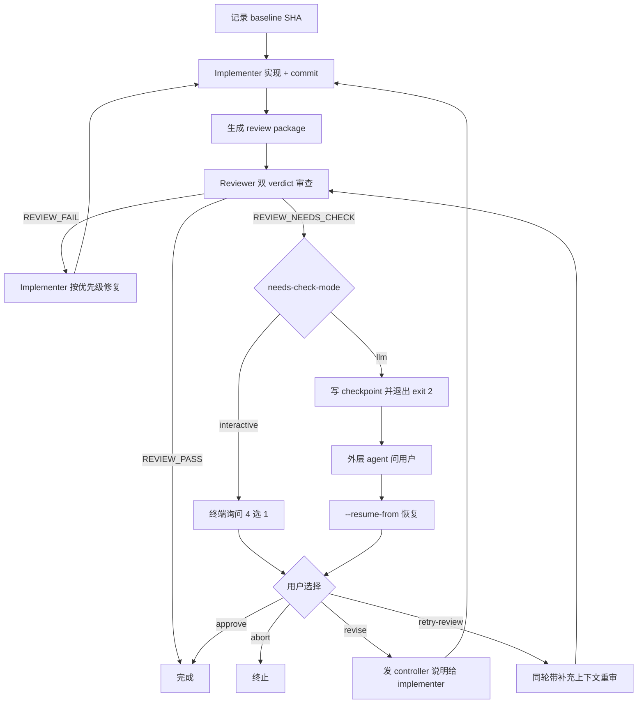

# herdr-orchestrator

一个最小可运行的 TypeScript 编排脚本，用来串起：

1. implementer agent 读 spec，按 skills 规划进度并 TDD 编码
2. 编排器生成 **review package**（git diff 文件），交给 reviewer
3. reviewer 做 **双 verdict 审查**（规格合规 + 代码质量），按 Critical/Important/Minor 分级反馈
4. review 失败时回到 implementer，按 `receiving-code-review` skill 修复
5. 最多循环固定轮数

Review 流程设计参考 [superpowers](https://github.com/obra/superpowers) 的 `requesting-code-review` / `subagent-driven-development` / `receiving-code-review`。

## 目录结构

```text
mini-orchestrator/
├── src
│   ├── checkpoint.ts
│   ├── cli.ts
│   ├── config.ts
│   ├── git.ts
│   ├── herdr.ts
│   ├── main.ts
│   ├── needs-check.ts
│   ├── review-package.ts
│   ├── types.ts
│   ├── utils.ts
│   └── workflow.ts
├── prompts
│   ├── implement.md
│   ├── review.md
│   ├── revise.md
│   ├── controller-implementer.md
│   └── controller-re-review.md
├── skills
│   ├── implementing-from-spec/
│   │   └── SKILL.md
│   ├── planning-with-files/
│   │   └── DEPENDENCY.md      # 外部 skill 引用说明（不含正文）
│   ├── receiving-code-review/
│   │   └── SKILL.md           # 接收 review 反馈（源自 superpowers）
│   └── test-driven-development/
│       └── SKILL.md
├── run-post-spec.ts
└── workflow.example.json
```

## Review 流程



每轮 review 前，编排器在 `projectDir/.orchestrator/` 生成 diff 审查包。基线为工作流启动时的 `HEAD`（若当时尚无 commit，则在 review 时从空树对比到当前 `HEAD`）。reviewer **先读该文件**再审查。

### 审查结果（三种）

| 状态 | 含义 | 编排器行为 |
|------|------|------------|
| `REVIEW_PASS` | spec ✅、quality Approved、无阻塞项、无可核查 ⚠️ | 结束 |
| `REVIEW_NEEDS_CHECK` | 无阻塞项，但 reviewer 无法仅从 diff 验证部分要求 | 暂停并询问用户（见下） |
| `REVIEW_FAIL` | 存在需修复项（spec ❌、quality Needs fixes、Critical/Important） | 发回 implementer revise |

### REVIEW_NEEDS_CHECK 交互

Reviewer 无法从 diff 单独验证的项**不等于实现缺陷**。编排器会暂停并展示 4 个选项：

| 选项 | 含义 |
|------|------|
| `approve` | 人工确认通过，结束工作流 |
| `revise` | 补充说明后发回 implementer（需填写说明） |
| `retry-review` | 带补充上下文让 reviewer **同轮**重审（需填写说明，不计入新轮次） |
| `abort` | 中止工作流 |

**默认模式（`--needs-check-mode interactive`）**：脚本在终端打印选项并等待输入，选完后继续执行。

**LLM 模式（`--needs-check-mode llm`）**：脚本写入 `projectDir/.orchestrator/needs-check-round-*.json` checkpoint，输出 `STATUS: ORCHESTRATOR_NEEDS_CHECK` 与 `CHECKPOINT: <path>`，以 **exit code 2** 退出。外层 agent 询问用户后，用 `--resume-from` 带上用户选择继续：

```bash
start-orchestrator \
  --resume-from "$PROJECT_DIR/.orchestrator/needs-check-round-1-....json" \
  --needs-check-action retry-review \
  --needs-check-notes "已在本地跑通 E2E，行为符合 spec"
```

### 双 Verdict

| Verdict | 含义 |
|---------|------|
| **Spec Compliance** | 实现是否满足 spec（不多做、不少做） |
| **Task quality** | 代码质量是否可接受 |

两项均通过且无 Critical/Important 问题时，reviewer 输出 `STATUS: REVIEW_PASS`。

### 严重程度

| 级别 | 处理 |
|------|------|
| Critical | 必须在本轮修复 |
| Important | 必须在本轮修复 |
| Minor | 顺手修或记入 progress，不阻塞 |

## Skill 依赖

| 阶段 | Skill | 路径 | 说明 |
|------|-------|------|------|
| implement | planning-with-files | `~/.agents/skills/planning-with-files/SKILL.md` | 外部依赖，从 spec 派生 `task_plan.md` |
| implement | implementing-from-spec | `./skills/implementing-from-spec/SKILL.md` | 实现流程、自审清单 |
| implement | test-driven-development | `./skills/test-driven-development/SKILL.md` | TDD 铁律 |
| revise | receiving-code-review | `./skills/receiving-code-review/SKILL.md` | 先验证再改、按严重程度修复 |

`skills.implement` 与 `skills.revise` 均可在 `workflow.json` 中覆盖。

### planning-with-files（外部依赖）

编排器**不会**把该 skill 复制进本仓库，而是在运行时读取 `~/.agents/skills/planning-with-files/SKILL.md` 并注入 implement prompt。请确保该路径存在且已在真实项目的 Cursor 中完成适配（hooks 自动更新 `task_plan.md` / `progress.md`）。

引用说明见 [`skills/planning-with-files/DEPENDENCY.md`](skills/planning-with-files/DEPENDENCY.md)。

## 运行方式

先复制示例配置：

```bash
cp workflow.example.json workflow.local.json
```

然后修改：

- `projectDir`
- `specPath`
- `implementer.command`
- `reviewer.command`

最后在 `HERDR_ENV=1` 的环境里执行：

```bash
npx tsx run-post-spec.ts --config workflow.local.json
npx tsx run-post-spec.ts --help
```

也可以用别名（默认读取当前目录下的 `workflow.local.json`）：

```bash
start-orchestrator
start-orchestrator --reuse-current-pane --specPath ./spec.md
```

### 复用当前 pane 作为 reviewer

如果希望 review 阶段直接使用当前 herdr pane（不再额外 `agent start` 一个 reviewer pane），在 reviewer pane 里运行脚本并加上 `--reuse-current-pane`：

```bash
npx tsx run-post-spec.ts \
  --config workflow.local.json \
  --reuse-current-pane
```

脚本会调用 `herdr pane current` 获取当前 pane 的 `pane_id`，并向该 pane 发送 review prompt。此模式下只会新建 implementer pane；`workflow.json` 里的 `reviewer` 配置不会被用来启动 agent，但建议保留以便切换回默认模式。

## CLI 参数

CLI 参数优先级高于 workflow 配置文件中的同名字段。

| 参数 | 必填 | 说明 |
|------|------|------|
| `--config` | 是 | workflow 配置文件的绝对或相对路径 |
| `--projectDir` | 否 | 项目目录，覆盖配置中的 `projectDir` |
| `--specPath` | 否 | spec 文件路径，覆盖配置中的 `specPath` |
| `--maxReviewRounds` | 否 | 最大 review 轮数，覆盖配置中的 `maxReviewRounds` |
| `--reuse-current-pane` | 否 | 复用当前 herdr pane 作为 reviewer，不新建 reviewer pane |
| `--needs-check-mode` | 否 | `interactive`（默认）或 `llm` |
| `--resume-from` | 否 | 从 needs_check checkpoint 恢复（需配合 `--needs-check-action`） |
| `--needs-check-action` | 否 | `approve` \| `revise` \| `retry-review` \| `abort` |
| `--needs-check-notes` | 否 | `revise` / `retry-review` 时必填的补充说明 |
| `-h`, `--help` | 否 | 显示使用帮助（不需要 `HERDR_ENV=1`） |

## 配置说明

`projectDir`、`specPath`、`maxReviewRounds` 可在配置文件中设置，也可通过 CLI 传入（CLI 优先）。至少需要为每个字段提供一种来源。

```json
{
  "projectDir": "/absolute/path/to/project",
  "specPath": "/absolute/path/to/spec.md",
  "maxReviewRounds": 4,
  "implementer": {
    "name": "implementer",
    "command": "cursor --model composer"
  },
  "reviewer": {
    "name": "reviewer",
    "command": "codex --model gpt-5.5"
  },
  "prompts": {
    "implement": "./prompts/implement.md",
    "review": "./prompts/review.md",
    "revise": "./prompts/revise.md"
  },
  "skills": {
    "implement": [
      "~/.agents/skills/planning-with-files/SKILL.md",
      "./skills/implementing-from-spec/SKILL.md",
      "./skills/test-driven-development/SKILL.md"
    ],
    "revise": [
      "./skills/receiving-code-review/SKILL.md"
    ]
  }
}
```

`skills.*` 支持相对路径（相对配置文件目录）、绝对路径，以及以 `~/` 开头的用户目录路径。

## Prompt 模板变量

- `implement.md`
  - `{{specPath}}`
  - `{{maxReviewRounds}}`
  - `{{implementSkills}}`
- `review.md`
  - `{{round}}`
  - `{{specPath}}`
  - `{{baseSha}}` / `{{headSha}}`
  - `{{diffFileSection}}` — diff 文件路径或降级说明
- `revise.md`
  - `{{round}}`
  - `{{reviewOutput}}`
  - `{{reviseSkills}}`
- `controller-implementer.md` / `controller-re-review.md` — needs_check 分支专用

## 当前限制

- 通过 `REVIEW_PASS` / `REVIEW_FAIL` / `REVIEW_NEEDS_CHECK` 及结构化双 verdict 判断流程。
- `REVIEW_NEEDS_CHECK` 在 LLM 模式下依赖 checkpoint 恢复；resume 须复用原 implementer/reviewer pane（勿关闭 Herdr session）。
- 非 git 项目或尚无 commit 时，review package 仅含未提交变更说明；reviewer 审查工作区与 planning 文件。
- 当前为整次实现的 review 轮询，尚未拆分为 superpowers 的 per-task 门禁。
- `splitCommand` 只覆盖常见引号场景，复杂 shell 语法还不适合直接塞进 `command`。
