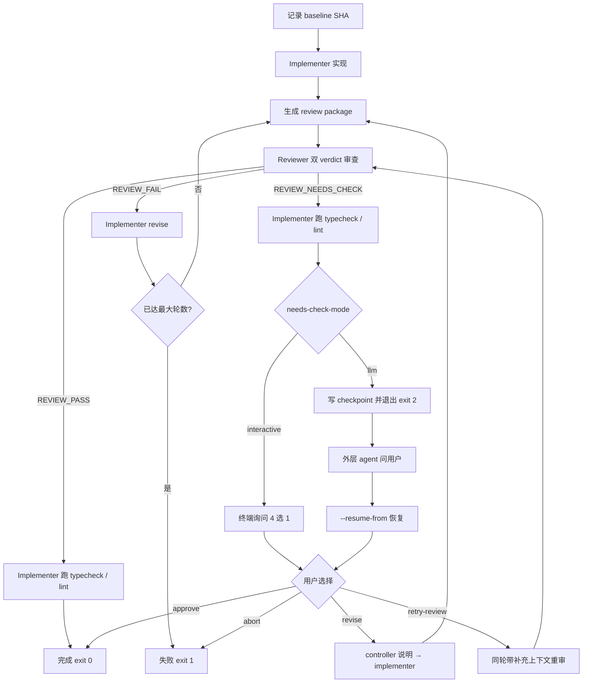

# mini-orchestrator

在 Herdr pane 内运行的最小 TypeScript 编排脚本，串起 implementer 与 reviewer agent：

1. implementer 读 spec，按 skills 规划进度并 TDD 编码
2. 编排器生成 **review package**（git diff 文件），交给 reviewer
3. reviewer 做 **双 verdict 审查**（规格合规 + 代码质量），按 Critical/Important/Minor 分级反馈
4. review 失败时回到 implementer，按 `receiving-code-review` skill 修复
5. 最多循环固定轮数

Review 流程设计参考 [superpowers](https://github.com/obra/superpowers) 的 `requesting-code-review` / `subagent-driven-development` / `receiving-code-review`。

## 运行模式

编排器支持两种运行模式，通过配置文件中的 `mode` 字段或 CLI `--mode` 参数指定：

### spec 模式（默认）

读取单个 `specPath`，执行一次实现 + review 循环。兼容旧配置（不写 `mode` 时默认为 spec 模式）。

参考配置：[`workflow.example.json`](workflow.example.json)

### issue 模式

读取 `issues[]` 数组，按数组顺序**串行**执行多个 issue。每个 issue 包含 `title` 和 `specPath`，复用相同的 implementer 与 reviewer agent。

参考配置：[`workflow.issue.example.json`](workflow.issue.example.json)

限制：
- issue 按数组顺序执行，不做并行调度
- 任一 issue 进入 `REVIEW_FAIL` 耗尽轮数后，整个工作流停止，后续 issue 不执行
- `needs_check` 暂停后 resume，继续的是当前 issue（而非跳到下一个）

## 目录结构

```text
mini-orchestrator/
├── src/
│   ├── checkpoint.ts      # needs_check checkpoint 读写
│   ├── cli.ts             # 参数解析与 --help
│   ├── config.ts          # 配置、prompt、skill 加载
│   ├── git.ts             # git 基线与命令封装
│   ├── herdr.ts           # herdr CLI 封装（agent start/send/wait）
│   ├── install-skill.ts   # skill 安装/卸载核心逻辑
│   ├── main.ts            # 入口：环境检查、错误码
│   ├── needs-check.ts     # REVIEW_NEEDS_CHECK 交互与 LLM 暂停
│   ├── review-package.ts  # 生成 diff 审查包
│   ├── session.ts         # 工作流 session 管理
│   ├── types.ts
│   ├── utils.ts           # verdict 解析、模板渲染
│   └── workflow.ts        # 主工作流编排（含 issue 队列）
├── prompts/
│   ├── implement.md
│   ├── review.md
│   ├── revise.md
│   ├── controller-implementer.md   # needs_check → revise 专用
│   ├── controller-re-review.md     # needs_check → retry-review 专用
│   └── post-review-check.md        # REVIEW_PASS / NEEDS_CHECK 后 typecheck / lint
├── scripts/
│   └── install-skill.ts   # skill 安装 CLI 入口
├── skills/
│   ├── implementing-from-spec/
│   │   └── SKILL.md
│   ├── issue-config/
│   │   └── SKILL.md               # 生成 issue 模式配置草案
│   ├── receiving-code-review/
│   │   └── SKILL.md                # 接收 review 反馈（源自 superpowers）
│   └── test-driven-development/
│       └── DEPENDENCY.md           # 外部 skill 引用说明（不含正文）
├── run-post-spec.ts       # CLI 入口（薄包装，实际逻辑在 src/）
├── workflow.example.json
├── workflow.issue.example.json
├── vitest.config.ts
└── package.json
```

运行时会在 `projectDir/.orchestrator/` 下生成：

| 文件 | 时机 |
|------|------|
| `review-round-{n}-{timestamp}.md` | 每轮 review 前 |
| `needs-check-round-{n}-{timestamp}.json` | LLM 模式下 REVIEW_NEEDS_CHECK 暂停时 |

## Review 流程



每轮 review 前，编排器在 `projectDir/.orchestrator/` 生成 diff 审查包。基线为工作流启动时的 `HEAD`（若当时尚无 commit，则从 git 空树 SHA 对比到当前 `HEAD`）。reviewer **先读该文件**再审查。

### Review package 内容

审查包为 Markdown，通常包含：

- **Commits** — `base..head` 范围内的 commit 列表
- **Diff Stat / Diff** — 完整 diff（`-U10` 上下文）
- **Uncommitted Changes**（若有）— `git status`、工作区与暂存区的 stat / diff

非 git 项目或无法生成 diff 时，review prompt 会降级为提示 reviewer 直接审查工作区改动。

### 审查结果（三种）

| 状态 | 含义 | 编排器行为 |
|------|------|------------|
| `REVIEW_PASS` | spec ✅、quality Approved、无阻塞项、无可核查 ⚠️ | implementer 校验 typecheck / lint（若有）→ 结束 |
| `REVIEW_NEEDS_CHECK` | 无阻塞项，但 reviewer 无法仅从 diff 验证部分要求 | implementer 校验 typecheck / lint（若有）→ 暂停并询问用户（见下） |
| `REVIEW_FAIL` | 存在需修复项（spec ❌、quality Needs fixes、Critical/Important） | 发回 implementer revise，进入下一轮 review |

编排器通过解析 reviewer 输出中的 `STATUS:` 行及结构化 verdict（Spec Compliance、Task quality、Issues 分级）判断上述状态。

### REVIEW_NEEDS_CHECK 交互

Reviewer 无法从 diff 单独验证的项**不等于实现缺陷**。编排器会暂停并展示 4 个选项：

| 选项 | 含义 |
|------|------|
| `approve` | 人工确认通过，结束工作流 |
| `revise` | 补充说明后发回 implementer（需填写说明），**下一轮** review |
| `retry-review` | 带补充上下文让 reviewer **同轮**重审（需填写说明，不计入新轮次） |
| `abort` | 中止工作流 |

**默认模式（`--needs-check-mode interactive`）**：脚本在终端打印选项并等待输入，选完后继续执行。

**LLM 模式（`--needs-check-mode llm`）**：脚本写入 `projectDir/.orchestrator/needs-check-round-*.json` checkpoint，输出 `STATUS: ORCHESTRATOR_NEEDS_CHECK` 与 `CHECKPOINT: <path>`，以 **exit code 2** 退出。外层 agent 询问用户后，用 `--resume-from` 带上用户选择继续：

```bash
start-orchestrator \
  --resume-from "$PROJECT_DIR/.orchestrator/needs-check-round-1-....json" \
  --needs-check-action retry-review \
  --needs-check-notes "已在本地跑通 E2E，行为符合 spec"
```

恢复时 `--config` 可省略（checkpoint 内保存了 `configPath`）；`revise` 从下一轮继续 review，`retry-review` 在同一轮用 `controller-re-review` prompt 重审。

在 issue 模式下 `approve` 当前 issue 后，若队列中还有后续 issue，编排器会自动继续执行下一项。

### Review 通过后静态检查

当 reviewer 输出 `REVIEW_PASS` 或 `REVIEW_NEEDS_CHECK` 后，编排器会向 implementer 发送 `post-review-check` prompt，要求其自行探测并运行项目的 TypeScript 类型检查与 lint（若存在对应配置或 `package.json` script）。implementer 负责修复问题并重复校验；编排器**不解析**检查输出，仅以 `IMPLEMENT_DONE` / `IMPLEMENT_ASK` 判断任务是否结束。

`REVIEW_NEEDS_CHECK` 时，静态检查在暂停询问用户**之前**执行，避免把类型或 lint 问题留给人工核查。

### 双 Verdict

| Verdict | 含义 |
|---------|------|
| **Spec Compliance** | 实现是否满足 spec（不多做、不少做） |
| **Task quality** | 代码质量是否可接受 |

两项均通过且无 Critical/Important 问题时，reviewer 输出 `STATUS: REVIEW_PASS`。

### 严重程度

| 级别 | 处理 |
|------|------|
| Critical | 必须在本轮修复 |
| Important | 必须在本轮修复 |
| Minor | 顺手修或记入 progress，不阻塞 |

## Skill 依赖

| 阶段 | Skill | 路径 | 说明 |
|------|-------|------|------|
| implement | implementing-from-spec | `./skills/implementing-from-spec/SKILL.md` | 实现流程、自审清单 |
| implement | test-driven-development | `~/.agents/skills/test-driven-development/SKILL.md` | 外部依赖，TDD 铁律 |
| revise | receiving-code-review | `./skills/receiving-code-review/SKILL.md` | 先验证再改、按严重程度修复 |

`skills.implement` 与 `skills.revise` 均可在 `workflow.json` 中覆盖。加载时会自动剥离 skill 文件的 YAML frontmatter。

### test-driven-development（外部依赖）

编排器**不会**把该 skill 复制进本仓库，而是从 `~/.agents/skills/test-driven-development/SKILL.md` 读取并注入 implement prompt。辅助文档 `testing-anti-patterns.md` 与 SKILL 同目录，由 implementer 在 SKILL 正文指引下按需阅读。

安装：将 [self-skills](https://github.com/lunoob/self-skills) 仓库克隆或同步到 `~/.agents/skills`。

## 运行方式

先复制示例配置：

```bash
cp workflow.example.json workflow.local.json   # spec 模式
# 或
cp workflow.issue.example.json workflow.local.json  # issue 模式
```

然后修改：

- `projectDir`
- `specPath` / `issues[]`
- `implementer.command`
- `reviewer.command`

最后在 `HERDR_ENV=1` 的环境里执行：

```bash
npx tsx run-post-spec.ts --config workflow.local.json
npx tsx run-post-spec.ts --config workflow.local.json --mode issue  # 用 CLI 覆盖模式
npx tsx run-post-spec.ts --help          # 不需要 HERDR_ENV=1
npm start -- --config workflow.local.json  # 等价于 tsx ./src/main.ts
```

也可以用别名（若 shell 已配置 `start-orchestrator` 指向 `run-post-spec.ts`，默认读取当前目录下的 `workflow.local.json`）：

```bash
start-orchestrator
start-orchestrator --reuse-current-pane --specPath ./spec.md
```

### 复用当前 pane 作为 reviewer

如果希望 review 阶段直接使用当前 herdr pane（不再额外 `agent start` 一个 reviewer pane），在 reviewer pane 里运行脚本并加上 `--reuse-current-pane`：

```bash
npx tsx run-post-spec.ts \
  --config workflow.local.json \
  --reuse-current-pane
```

脚本会调用 `herdr pane current` 获取当前 pane 的 `pane_id`，并向该 pane 发送 review prompt。此模式下只会新建 implementer pane；`workflow.json` 里的 `reviewer` 配置不会被用来启动 agent，但建议保留以便切换回默认模式。

### 退出码

| Code | 含义 |
|------|------|
| `0` | 工作流正常结束（review 通过或人工 approve） |
| `1` | 失败（配置错误、review 耗尽轮数、用户 abort 等） |
| `2` | LLM 模式下 REVIEW_NEEDS_CHECK 暂停，等待 `--resume-from` |

## CLI 参数

CLI 参数优先级高于 workflow 配置文件中的同名字段。

| 参数 | 必填 | 说明 |
|------|------|------|
| `--config` | 首次启动必填；resume 时可省略 | workflow 配置文件的绝对或相对路径 |
| `--mode` | 否 | 运行模式：`spec`（默认）\| `issue`，覆盖配置中的 `mode` |
| `--projectDir` | 否 | 项目目录，覆盖配置中的 `projectDir` |
| `--specPath` | 否 | spec 文件路径，覆盖配置中的 `specPath` |
| `--maxReviewRounds` | 否 | 最大 review 轮数，覆盖配置中的 `maxReviewRounds`（默认 8） |
| `--reuse-current-pane` | 否 | 复用当前 herdr pane 作为 reviewer，不新建 reviewer pane |
| `--needs-check-mode` | 否 | `interactive`（默认）或 `llm` |
| `--resume-from` | 否 | 从 needs_check checkpoint 恢复（需配合 `--needs-check-action`） |
| `--needs-check-action` | resume 时必填 | `approve` \| `revise` \| `retry-review` \| `abort` |
| `--needs-check-notes` | `revise` / `retry-review` 时必填 | 补充说明 |
| `-h`, `--help` | 否 | 显示使用帮助（不需要 `HERDR_ENV=1`） |

spec 模式至少需要为 `projectDir`、`specPath` 各提供一种来源（配置文件或 CLI）。
issue 模式需要配置文件中包含 `issues[]` 数组。

## 配置说明

### spec 模式

```json
{
  "projectDir": "/absolute/path/to/project",
  "specPath": "/absolute/path/to/spec.md",
  "maxReviewRounds": 4,
  "implementer": {
    "name": "implementer",
    "command": "cursor --model composer",
    "agentReadyPattern": "Cursor Agent"
  },
  "reviewer": {
    "name": "reviewer",
    "command": "codex --model gpt-5.5",
    "agentReadyPattern": "codex"
  },
  "prompts": {
    "implement": "./prompts/implement.md",
    "review": "./prompts/review.md",
    "revise": "./prompts/revise.md"
  }
}
```

### issue 模式

```json
{
  "projectDir": "/absolute/path/to/project",
  "mode": "issue",
  "issues": [
    {
      "title": "Step 1: Setup database schema",
      "specPath": "/absolute/path/to/specs/db-schema.md"
    },
    {
      "title": "Step 2: Implement API endpoints",
      "specPath": "/absolute/path/to/specs/api-endpoints.md"
    }
  ],
  "maxReviewRounds": 4,
  "implementer": {
    "name": "implementer",
    "command": "cursor --model composer",
    "agentReadyPattern": "Cursor Agent"
  },
  "reviewer": {
    "name": "reviewer",
    "command": "codex --model gpt-5.5",
    "agentReadyPattern": "codex"
  },
  "prompts": {
    "implement": "./prompts/implement.md",
    "review": "./prompts/review.md",
    "revise": "./prompts/revise.md"
  }
}
```

### 完整配置项

`prompts.controllerImplementer`、`prompts.controllerReReview` 与 `prompts.postReviewCheck` 为可选项，省略时使用默认路径（见源代码 `src/config.ts` 中的常量）。

`implementer.agentReadyPattern` / `reviewer.agentReadyPattern`（可选）：`agent start` 后、`send` 首条 prompt 前，除等待 `idle` 外，再用 `herdr wait output --match` 等待 pane 输出中出现该文本，避免 agent UI 尚未就绪时 prompt 丢失。发送后编排器会等待 `working → idle` 确认任务被接收并完成；若未进入 `working` 会重试一次发送。

常见示例：Cursor Agent 用 `"Cursor Agent"`，Codex 用 `"codex"` 或启动横幅中的特征字符串。省略时仅依赖 `idle` 状态等待。

`skills.*` 支持相对路径（相对配置文件目录）、绝对路径，以及以 `~/` 开头的用户目录路径。

## Prompt 模板变量

- `implement.md`
  - `{{specPath}}`
  - `{{maxReviewRounds}}`
  - `{{implementSkills}}`
- `review.md`
  - `{{round}}`
  - `{{specPath}}`
  - `{{baseSha}}` / `{{headSha}}`
  - `{{diffFileSection}}` — diff 文件路径或降级说明
- `revise.md`
  - `{{round}}`
  - `{{reviewOutput}}`
  - `{{reviseSkills}}`
- `controller-implementer.md`
  - `{{round}}`
  - `{{controllerNotes}}`
  - `{{reviewOutput}}`
  - `{{reviseSkills}}`
- `controller-re-review.md`
  - `{{round}}`
  - `{{specPath}}`
  - `{{baseSha}}` / `{{headSha}}`
  - `{{diffFileSection}}`
  - `{{controllerNotes}}`
  - `{{reviewOutput}}`
- `post-review-check.md`
  - `{{round}}`
  - `{{reviewStatus}}` — `REVIEW_PASS` 或 `REVIEW_NEEDS_CHECK`

## Skill 安装

仓库内 `skills/` 目录下提供了一组可安装的 skill，供编排器的 implementer / reviewer agent 使用。通过安装脚本可将 skill 部署到 `~/.agents/skills/`。

### 内置 Skill

| Skill | 路径 | 说明 |
|-------|------|------|
| issue-config | `./skills/issue-config/SKILL.md` | 生成编排器 `issue` 模式配置草案 |

### 安装命令

```bash
npm run install-skill               # 以软链接安装所有内置 skill
npm run install-skill -- --mode copy # 以复制模式安装
npm run install-skill -- --force     # 覆盖已有安装
```

安装目标：`~/.agents/skills/<skill-name>/`

软链接与复制模式的区别：

| 模式 | 行为 | 适用场景 |
|------|------|----------|
| `symlink`（默认） | 在 `~/.agents/skills/` 创建指向仓库 `skills/` 的软链接 | 仓库更新后自动生效，无需重新安装 |
| `copy` | 将 skill 文件复制到 `~/.agents/skills/` | 目标环境无法创建软链接（如某些 CI、容器），或需要独立副本 |

### 卸载

```bash
npm run uninstall-skill             # 卸载软链接安装的 skill
npm run uninstall-skill -- --force   # 强制卸载（含复制模式目录）
```

## 开发

```bash
npm test            # vitest run
npm run typecheck   # tsc --noEmit
```

## 当前限制

- 通过 `REVIEW_PASS` / `REVIEW_FAIL` / `REVIEW_NEEDS_CHECK` 及结构化双 verdict 判断流程；不解析 implementer 的 `STATUS: IMPLEMENT_DONE`，以 `herdr agent wait --status working` 确认任务被接收、再以 `idle` 判断任务结束。
- `REVIEW_NEEDS_CHECK` 在 LLM 模式下依赖 checkpoint 恢复；resume 须复用原 implementer/reviewer pane（勿关闭 Herdr session）。
- 非 git 项目或尚无 commit 时，review package 仅含未提交变更说明；reviewer 审查工作区改动。
- issue 模式为串行执行；并行调度不在此版本范围内。
- agent 空闲等待超时为 30 分钟（`herdr agent wait --timeout 1800000`）。
- `splitCommand` 只覆盖常见引号场景，复杂 shell 语法还不适合直接塞进 `command`。
