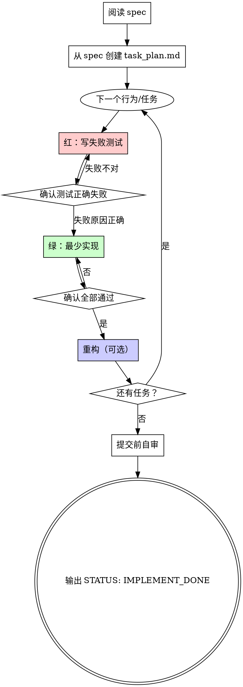

# 根据 Spec 实现

## 概述

读 spec → **先 TDD 再写生产代码** → 自审 → 报告完成。

**核心原则：** 没有亲眼看到测试针对新行为失败，就不写生产代码。违反字面规则即违反精神。

## 铁律

```
没有先失败的测试，就不写生产代码
```

与 `test-driven-development` skill 一并加载；两者冲突时以更严格的为准。

## 流程



## 1. 阅读 Spec

- 完整阅读 spec，理解验收标准、边界条件、非目标（YAGNI）
- 不清楚的地方先问用户，不要猜
- 浏览项目现有代码与测试风格，对齐约定

## 2. 制定实现计划（planning-with-files）

**必须先按已加载的 `planning-with-files` skill 从 spec 创建并维护 planning 文件**，不要用 TodoWrite 替代磁盘进度。

从 spec 派生 `task_plan.md`（及 `progress.md`），按依赖顺序列出每个可交付行为/阶段。计划应包含：

- 要改哪些文件
- 每个行为的测试策略（测什么、不测什么）
- 不实现 spec 未要求的内容

每完成一个阶段：更新 `task_plan.md` 状态，并在 `progress.md` 记录 TDD 结果与改动摘要。调研与踩坑写入 `findings.md`。

## 3. 按 TDD 实现

**每个行为、每个任务都必须走完整红-绿-重构循环。** 细则见已加载的 `test-driven-development` skill。

实现过程中：

- 迭代时只跑当前相关测试；**提交前**跑完整测试套件
- 遵循项目既有模式；只改 spec 范围内的代码
- 不加 spec 未要求的功能（YAGNI）
- 测试验证真实行为，避免无意义的 mock

## 4. 提交前自审

在输出 `STATUS: IMPLEMENT_DONE` 之前，逐项检查：

**完整性（Spec Compliance）：**
- [ ] spec 中的每项要求都已实现
- [ ] 没有多做 spec 未要求的功能
- [ ] 边界条件与错误路径已覆盖

**质量（Code Quality）：**
- [ ] 命名清晰，职责单一
- [ ] 错误处理合理
- [ ] 无重复逻辑（DRY，但不过早抽象）

**TDD 纪律：**
- [ ] 每个新行为都有测试
- [ ] 每个新测试在实现前都观察过正确失败
- [ ] 全部测试通过，输出干净（无错误、无警告）

**Planning 文件：**
- [ ] `task_plan.md` 中所有阶段已标记 complete
- [ ] `progress.md` 已记录最终实现与测试摘要

有任一项未满足：继续修改，不要输出 `STATUS: IMPLEMENT_DONE`。

## 5. 完成报告

自审通过后输出：

```
STATUS: IMPLEMENT_DONE
```

并在消息中简要说明：
- 实现了什么（对照 spec 要点）
- 测试如何覆盖（列举关键测试）
- 若有 spec 中未覆盖的疑虑，明确列出

## 常见自我合理化

| 借口 | 现实 |
|------|------|
| 「spec 很简单，先写代码」 | 简单代码也会坏。先写失败测试。 |
| 「我之后再补测试」 | 事后测试立刻通过，证明不了任何事。 |
| 「手动测过了」 | 手动 ≠ 系统。无记录，无法防回归。 |
| 「保留代码当参考边写测试」 | 那是事后测试，不是 TDD。 |
| 「这次例外」 | 没有例外。 |

## 红旗 — 停下并纠正

- 新行为没有先失败的测试
- 测试针对新行为立刻通过
- 说不清测试为什么应该失败
- spec 有遗漏或多做了功能
- 测试套件有失败或警告仍要标记完成
