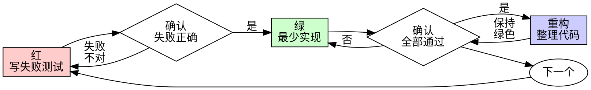

# 测试驱动开发（TDD）

## 概述

先写测试。观察它失败。写最少代码让它通过。

**核心原则：** 如果你没有亲眼看到测试失败，就无法确定它测的是正确的东西。

**违反规则的字面意思，就是违反规则的精神。**

## 何时使用

**始终适用：**

- 新功能
- Bug 修复
- 重构
- 行为变更

**例外（需询问用户）：**

- 一次性原型
- 生成代码
- 配置文件

想「就这一次跳过 TDD」？停。那是自我合理化。

## 铁律

```
没有先失败的测试，就不写生产代码
```

**若实现已经存在：**

1. 先为**尚未覆盖的新行为**补写失败测试
2. 运行测试
3. 若测试**立刻通过**，说明没有测到新行为——**加强测试**（更精确的断言、边界条件、错误路径），或**重写实现**使行为可验证

**不要**因为「代码已经写好了」就跳过补测；**也不要**保留明显测不到新行为的测试。

**禁止的做法：**

- 把已有实现仅当作「参考」，边写测试边偷偷改实现来迎合测试
- 测试一绿就宣布完成，而不确认它曾针对新行为失败过

## 红-绿-重构



### 红 — 写失败测试

写一个最小的测试，表达「应该发生什么」。

**好：**

```typescript
test('失败操作重试 3 次', async () => {
  let attempts = 0;
  const operation = () => {
    attempts++;
    if (attempts < 3) throw new Error('fail');
    return 'success';
  };

  const result = await retryOperation(operation);

  expect(result).toBe('success');
  expect(attempts).toBe(3);
});
```

清晰命名、测真实行为、只测一件事。

**差：**

```typescript
test('retry works', async () => {
  const mock = jest.fn()
    .mockRejectedValueOnce(new Error())
    .mockRejectedValueOnce(new Error())
    .mockResolvedValueOnce('success');
  await retryOperation(mock);
  expect(mock).toHaveBeenCalledTimes(3);
});
```

命名含糊、测的是 mock 而不是代码。

**要求：**

- 一个行为
- 清晰命名
- 真实代码（除非不可避免，否则不用 mock）

### 确认红 — 观察失败

**强制步骤，不可跳过。**

```bash
npm test path/to/test.test.ts
```

确认：

- 测试**失败**（不是报错崩溃）
- 失败信息与预期一致
- 失败原因是**功能缺失**（不是拼写错误）

**测试通过了？** 说明测的是已有行为。修正测试，或加强断言以覆盖新行为。

**测试报错？** 先修错误，再跑到「正确失败」为止。

**已有实现且测试立刻通过？** 测试没有覆盖新行为。加强测试或重写相关实现。

### 绿 — 最少实现

写能通过测试的最简代码。

**好：**

```typescript
async function retryOperation<T>(fn: () => Promise<T>): Promise<T> {
  for (let i = 0; i < 3; i++) {
    try {
      return await fn();
    } catch (e) {
      if (i === 2) throw e;
    }
  }
  throw new Error('unreachable');
}
```

刚好够用。

**差：**

```typescript
async function retryOperation<T>(
  fn: () => Promise<T>,
  options?: {
    maxRetries?: number;
    backoff?: 'linear' | 'exponential';
    onRetry?: (attempt: number) => void;
  }
): Promise<T> {
  // YAGNI
}
```

过度设计。

不要加测试未要求的功能，不要顺手重构无关代码，不要超出测试范围「改进」。

### 确认绿 — 观察通过

**强制步骤，不可跳过。**

```bash
npm test path/to/test.test.ts
```

确认：

- 测试通过
- 其他测试仍通过
- 输出干净（无错误、无警告）

**测试失败？** 修代码，不要改测试来凑合。

**其他测试失败？** 立刻修复。

### 重构 — 整理

仅在全绿之后：

- 去重
- 改善命名
- 提取辅助函数

保持测试绿色，不增加新行为。

### 重复

为下一个行为写下一个失败测试。

## 好测试的标准

| 品质 | 好 | 差 |
|------|----|----|
| **最小** | 只测一件事。名字里有「并且」？拆开。 | `test('校验邮箱并且域名并且空白')` |
| **清晰** | 名字描述行为 | `test('test1')` |
| **表达意图** | 展示期望的 API | 掩盖代码应做什么 |

## 为什么顺序很重要

**「我先实现，写完再补测试验证」**

事后写的测试会立刻通过。立刻通过证明不了任何事：

- 可能测错了东西
- 可能测的是实现细节，不是行为
- 可能漏掉你没想到的边界情况
- 你从未见过它抓住 bug

先写测试迫使你看到失败，从而证明测试真的在测东西。

**「我已经手动测过所有边界情况了」**

手动测试是随意的。你以为测全了，但：

- 没有测试记录
- 代码变更后无法重跑
- 压力下容易遗漏
- 「我试的时候能用」≠ 覆盖全面

自动化测试是系统性的，每次运行方式相同。

**「补测试只要 30 分钟，重写太浪费」**

沉没成本谬误。时间已经花了。现在的选择：

- 补失败测试并确认曾失败（多花一些时间，信心高）
- 写个立刻通过的测试糊弄过去（快，信心低，容易埋 bug）

不可信的「有测试的代码」才是技术债。

**「TDD 太教条，务实应该灵活」**

TDD 才是务实的：

- 提交前发现 bug（比事后调试快）
- 防止回归（测试立刻抓住破坏）
- 记录行为（测试展示用法）
- 支持重构（放心改，测试兜底）

「务实」的捷径 = 生产环境调试 = 更慢。

**「事后测试能达到同样目的——重要的是精神不是仪式」**

不能。事后测试回答的是「这段代码做了什么？」先写测试回答的是「应该做什么？」

事后测试受实现偏见影响：你测的是你写出来的，不是需求要求的。你验证的是记得的边界，不是发现的边界。

先写测试迫使你在实现前发现边界。事后测试验证你是否都记得（通常没有）。

事后补 30 分钟测试 ≠ TDD。你有覆盖率，但没有证明测试有效。

## 常见自我合理化

| 借口 | 现实 |
|------|------|
| 「太简单不用测」 | 简单代码也会坏。写测试只要 30 秒。 |
| 「我之后再测」 | 立刻通过的测试证明不了任何事。 |
| 「事后测试目的相同」 | 事后 =「做了什么」；先写 =「应该做什么」 |
| 「已经手动测过了」 | 随意 ≠ 系统。无记录，无法重跑。 |
| 「保留代码当参考，先写测试」 | 你会边改边迎合。那就是事后测试。 |
| 「需要先探索」 | 可以。扔掉探索代码，或用探索结论写失败测试再实现。 |
| 「难测说明设计不清」 | 听测试的话。难测往往难用。 |
| 「TDD 会拖慢我」 | TDD 比调试快。务实 = 先写测试。 |
| 「手动更快」 | 手动证明不了边界。每次改动都要重测。 |
| 「老代码没测试」 | 你在改进它。为要改的部分补测试。 |
| 「实现都写好了，补个测试就行」 | 若立刻通过，说明没测到新行为。加强测试或重写。 |

## 红旗 — 停下并纠正

- 新行为没有先失败的测试
- 测试立刻通过，但本应覆盖新行为
- 说不清测试为什么失败（或为什么应该失败）
- 「之后再补测试」
- 「就这一次例外」
- 「已经手动测过了」
- 「事后测试目的一样」
- 「重要的是精神不是仪式」
- 「保留当参考」或「边写测试边改实现」
- 「TDD 太教条，我比较务实」
- 「这次情况不同因为……」

**出现以上情况：补写或加强失败测试，确认曾正确失败，再继续。**

## 示例：Bug 修复

**Bug：** 空邮箱被接受

**红**

```typescript
test('拒绝空邮箱', async () => {
  const result = await submitForm({ email: '' });
  expect(result.error).toBe('Email required');
});
```

**确认红**

```bash
$ npm test
FAIL: expected 'Email required', got undefined
```

**绿**

```typescript
function submitForm(data: FormData) {
  if (!data.email?.trim()) {
    return { error: 'Email required' };
  }
  // ...
}
```

**确认绿**

```bash
$ npm test
PASS
```

**重构**

若需要，提取多字段共用的校验逻辑。

## 验收清单

标记完成前：

- [ ] 每个新函数/方法都有测试
- [ ] 每个新测试在实现前都观察过失败（或确认已有实现时测试曾针对新行为正确失败）
- [ ] 每个测试都因预期原因失败（功能缺失，不是笔误）
- [ ] 写了最少代码让每个测试通过
- [ ] 全部测试通过
- [ ] 输出干净（无错误、无警告）
- [ ] 测试使用真实代码（仅在必要时 mock）
- [ ] 覆盖边界与错误路径

有任一未勾选？你跳过了 TDD。回到失败测试这一步。

## 卡住时

| 问题 | 做法 |
|------|------|
| 不知道怎么测 | 先写期望的 API。先写断言。询问用户。 |
| 测试太复杂 | 设计可能太复杂。简化接口。 |
| 什么都得 mock | 耦合太重。用依赖注入。 |
| 测试搭建太长 | 提取辅助函数。仍复杂？简化设计。 |

## 与调试结合

发现 bug？先写能复现它的失败测试，再走 TDD 循环。测试既证明修复有效，也防止回归。

**不要在没有测试的情况下修 bug。**

## 测试反模式

添加 mock 或测试工具时，阅读 [testing-anti-patterns.md](testing-anti-patterns.md)，避免：

- 测 mock 行为而不是真实行为
- 在生产类里加仅测试用的方法
- 不理解依赖就 mock

## 最终规则

```
生产代码 → 先有测试，且针对新行为曾正确失败
否则 → 不是 TDD
```

未经用户同意，无例外。
